# 3. 저장소 설계와 검증 계획

상태: 기존 구조 확인 + 후속 작업 제안. 아래 `제안 경로`는 생성·구현됐다는 뜻이 아니다.

## 3.1 저장소를 새로 나누지 않는다

| 저장소 | 책임 | 재사용할 현재 코드/자료 | 제안하는 최소 추가 |
| --- | --- | --- | --- |
| Data-Pipeline | 원문·판본·출처·권리·분석 범위 보존 | canonical books/documents/toc/sources, evidence export | 필요한 절과 원문 위치의 수집/추출 경로. 수준 추정은 넣지 않음 |
| ML | 책 속성 분석, 독자 관찰 집계, 매칭·평가 | assessment/concept_blueprint.py, concept_v2/learning_fit.py, configs | 오프라인 reader–text-fit 실험, 속성 schema·규칙·비교 보고 |
| Question-Generation | 설계서에서 문항 후보 생성·검사·검토 자료 작성 | concept_contract.py, concept_generation.py, review 명령 | 독립적인 사후평가 packet. ML의 측정 목표를 임의 변경하지 않음 |
| Backend | 계정·발급·응답·snapshot·접근 통제 | assessment, learning, import 서비스 | 오프라인 실험 채택 뒤 phase/목표/정책 버전의 추가 계약 |
| Frontend/native | 목표 입력, 진단·열람·결과 표시 | assessment.tsx, QuestionContent, learningRecommendations | 실험 채택 뒤 근거별 설명/동일 후보군 표시 |
| Docs | 설계·결정·실험 요약·발표 | 이 문서 묶음 | 날짜별 근거와 교수 피드백 갱신 |

다른 저장소의 Python 모듈을 직접 import하지 않는다. JSON 산출물과 hash가 경계다.
원문 및 실제 참가자 기록은 공개 Git에 넣지 않는다. 공개 가능한 집계·manifest·합성 예시는 구분해 보관한다.

## 3.2 현재 웹 실행 구조

이 그림은 현재 구현된 경로이며 모든 서비스가 지금 실행 중이라는 뜻은 아니다.
새 모델의 본문 분석과 문항 생성은 온라인 요청마다 실행하지 않고 사전 배치로 준비하는 제안이다.
로그인/진단 요청에서 외부 생성 모델을 반드시 호출하는 구조로 바꾸지 않는다.

## 3.3 목표 데이터 흐름

Data-Pipeline의 고정 canonical → ML의 책 속성 후보 → 검토된 속성 artifact.
ML의 측정 설계서 → Question-Generation의 문항 후보 → 검토된 사전/사후 packet.
사전 문항과 책 속성만 매칭 입력에 사용. 사후평가 결과는 분리된 평가 보고서로 보낸다.

| 산출물 (제안) | 필수 의미 | 소유 저장소 |
| --- | --- | --- |
| passage manifest | book/edition/section/source, 원문 범위·hash·언어·권리, 분석 대상 포함/제외 사유 | Data-Pipeline |
| book requirements | concept, 요구 수행, covered/assumed/introduced/practiced, 원문 위치, unknown, review | ML |
| question specification | 측정 주장·근거·과제·phase·가족·버전 | ML |
| generated item packet | 내용·정답·채점·생성/검토·spec hash | Question-Generation |
| observation | 익명 연구 ID, 문항 버전, phase, 응답/채점, 언어/열람/노출 조건 | Backend 또는 초기 실험 파일 |
| match result | policy/version, 입력 hash, 후보·근거·비교보류/동률, 설명에 사용한 속성 | ML → Backend |
| evaluation report | split/manifest/policy/model hash, 측정 단위·분모·제외·실패 사례 | ML → Docs |

계약 이름과 API 경로는 오프라인 예시로 의미를 합의한 뒤 확정한다. 기존 v5의 뜻을 바꾸지 않는다.
필드가 늘어나도 누락값은 unknown/null로 유지하며 임의의 점수나 검토자를 채우지 않는다.

## 3.4 개발 순서와 저장소별 변경 묶음

| 단계 | 실제 개발 범위 | 완료 조건 |
| --- | --- | --- |
| 0. 현재 상태 고정 | Docs에 current-code 재현 결과·설계 작성 | 같은 입력/코드에서 결과를 다시 얻음, 가상 응답 표기 |
| 1. 작은 자료 묶음 | Data-Pipeline에서 판본·절·권리 manifest, ML에서 속성 라벨 양식 | 비교 가능한 실제 본문과 독립 검토 가능 여부 확인 |
| 2. 수동으로 기준 확인 | ML 실험에서 사람이 검토한 속성으로 매칭 비교 | 책 차이를 구별할 속성과 실패 사례 확인 |
| 3. 모델의 추출 역할 검증 | ML 배치 adapter/schema, 고정 모델·prompt, 독립 자료 평가 | 규칙/수동 속성 기준과 추출 오류·비용 비교 |
| 4. 문항 검증 | QG의 사전 bank 감사와 사후 packet | 별도 가족·phase·정답 근거·검토 상태 확보 |
| 5. 예비 독자 실험 | 오프라인 기록/분석부터 시작 | 모집·조건·분모·누락·피드백을 추적 가능 |
| 6. 제품 연결 | 채택한 정책만 Backend/Frontend에 연결 | 버전 호환·snapshot·권한·실제 경로 확인 |

단계 2에서 수동 속성으로도 좋은 매칭을 설명하지 못하면 단계 3의 모델 학습을 서두르지 않는다.
단계 3에서 오류가 크면 human-reviewed 속성을 사용한 제한된 데모와 추출 한계를 함께 발표한다.
오프라인 결과가 좋아도 곧바로 기존 사용자 프로필/추천을 재계산해 덮어쓰지 않는다.

제안 경로 예: ML `experiments/reader_text_fit/`, `configs/experiments/reader-text-fit-pilot-v1.json`.
실험이 안정된 뒤에만 공용 서비스 모듈로 올린다. 이번 문서 작업은 해당 폴더를 만들지 않았다.
백엔드 팀원에게 맡길 명확한 산출물은 versioned import, 입력 검증, 응답 snapshot, 실험 export다.
측정 기준·학습 라벨 설계는 사용자와 전공 검토자가 먼저 정한다.

## 3.5 평가를 세 층으로 나눈다

| 평가 질문 | 대상 | 측정 예시 | 의미하지 않는 것 |
| --- | --- | --- | --- |
| 책을 제대로 분석했나 | 본문 속성과 근거 위치 | 속성별 precision/recall, 근거 지지율, unknown 비율, 검토자 불일치 | 추천 정확도 |
| 독자 관찰이 의미 있나 | 사전 문항과 독립 과제 | 셀별 수행, 문항 오류·천장/바닥 현상, 별도 과제와의 일치 | 한두 문항으로 확정한 숙달 |
| 실제 매칭이 더 나은가 | 동일 독자·목표·후보의 추천 | 블라인드 쌍대 선호, 상위 후보 적합성, 심한 요구 불일치, 비교보류율 | 장기 학습 효과 |

설명은 별도로 평가한다. 설명의 각 문장이 원문·응답·실제 계산 속성으로 추적되는지 확인한다.
설명이 설득력 있어 보인다는 평가는 추천 책 자체의 적합성 평가와 섞지 않는다.

## 3.6 비교 실험 설계 초안

- B0: 분야만 맞춘 고정 목록. 모든 독자에게 같은 후보 순서. 개발 단계에 순서를 고정.
- B1: 현재 `concept-learning-v2`.
- B2: 새 속성 기반 매칭 후보. **사람이 검토한 속성**을 사용해 매칭 원리를 먼저 검사.
- B3: B2와 같은 정책에 **모델이 추출한 속성**을 사용. B2와의 차이로 추출 오류 영향을 분리.

모든 방식에 같은 후보 자료·동일 시점 사전 응답·동일 목표를 제공한다. B1이 목표를 쓰지 않는 것은
명시된 정책 차이다. 결측으로 제외한 후보 수와 적용 범위를 모든 결과에 함께 낸다.
비교보류를 허용한 B2가 어려운 사례를 모두 제외해 높은 점수만 얻지 않도록 **성능과 적용률을 함께** 보고한다.

평가자에게 방법 이름과 추천 설명을 숨기고, 후보 제시 위치를 균형 있게 바꾼다.
평가자는 같은 독자·목표·원문을 보고 A/B/동률/판단불가와 이유를 남긴다.
실제 독자에게는 선호뿐 아니라 정해진 범위의 읽기 후 과제와 체감 부담을 기록한다.
같은 내용을 연속해서 읽으면 학습 전이가 생기므로 순서 균형과 주제/과제 배치를 설계한다.
동일 내용을 완전히 통제하지 못한 작은 실험은 탐색 결과로 발표한다.

## 3.7 데이터 분할과 통계 주장

1. 같은 책의 판본·번역·유사 절은 work group으로 묶는다. 같은 문항 가족도 함께 묶는다.
2. 평가용 책/문항/참가자 결과를 프롬프트 수정이나 임계값 선택에 쓰지 않는다.
3. 개발 세트에서 기준을 정한 뒤 holdout을 한 번 평가한다. 자료가 너무 작으면 홀드아웃 성능을 주장하지 않는다.
4. 문항 수를 참가자 수처럼 세지 않는다. 반복 관찰은 독자/책 단위의 의존성을 가진다.
5. 참가자 수는 모집 여건과 첫 결과의 변동을 본 뒤 계획한다. 소수 파일럿으로 유의성이나 보편적 정확도를 약속하지 않는다.
6. 원시 건수·분모·판단불가·동률·실패 사례를 우선 보고한다. 신뢰구간·통계 검정은 표본 설계가 뒷받침할 때 사용한다.

금요일까지는 실제 참가자 모집을 전제하지 않는다. 다음 주 자료 역시 실제 완료한 범위만 결과로 표기한다.
평가자가 사용자 한 명뿐이면 내부 검토, 모델뿐이면 AI 검토라고 명시한다.

## 3.8 실패 시 방향 전환

- 본문 확보 불가: 해당 책의 ‘요구 수준’ 분석을 보류. 공개 사용 가능한 소수 자료로 범위를 변경.
- 속성 판단 합의 부족: 복잡한 수준 레이블을 줄이고 관찰 가능한 수행·출처 단위로 정의를 수정.
- 모든 책이 같은 범주: 더 세밀한 평가 데이터 필요. ID 순위나 임의 가중치로 차이를 꾸미지 않음.
- B2가 B1/B0보다 낫지 않음: 새 정책을 활성화하지 않고 실패 원인을 결과로 남김.
- B3만 나쁨: 추출 모델/문맥 범위/라벨을 개선. 매칭 정책의 문제와 구별.
- 사후 과제가 너무 쉽거나 어려움: 해당 측정의 한계를 보고하고 새 가족 문항으로 예비 검증.

## 3.9 변경 검증 원칙

문서만 바꾸면 링크·다이어그램·근거의 일치 여부를 검사한다.
코드를 바꾸면 해당 저장소 지침을 읽고 계약/기능에 맞는 검사를 한다.
ML 실험은 결정적 재실행·누수·결측 처리, QG는 spec/정답/노출/가족 분리,
Backend는 기존 발급 snapshot·권한·호환성, Frontend는 의미를 바꾸지 않는 표시를 검증한다.
모델 성능 검사를 단위 테스트 개수로 대체하지 않는다.
