# 설명 가능한 독자–책 매칭: 면담·중간발표 설계안

작성: 2026-10-05. **설계 초안 v0.1 — 새로운 추천 정책의 적용 승인이 아님.**

금요일 **2026-10-09 교수 면담**, 다음 주 중간발표를 준비한다. 중간발표 정확한 날짜는 미정이다.
추천/AI 설계는 사용자 1명이 맡고, 다른 팀원은 백엔드 중심으로 기여할 수 있다는 조건을 반영했다.

## 먼저 읽기

1. [교수 면담 자료와 실행 일정](04-meeting-and-roadmap.md): 현재 한 일, 보여줄 결과, 질문, 8장 발표 흐름.
2. [추천 원리와 모델 선택](01-matching-design.md): 무엇을 비교하며 모델을 어디에 쓸 것인가.
3. [문제 생성·데이터 계약](02-assessment-design.md): 읽기 전 진단과 읽기 후 평가의 분리.
4. [저장소 설계·검증 계획](03-architecture-and-evaluation.md): 기존 코드 재사용, 개발 순서, 성능 평가.
5. [현재 추천 재현 사례](evidence/current-recommendation.md): 현재 ML 코드의 실제 계산, 가상 응답임을 명시.

## 상태를 읽는 법

| 표시 | 의미 |
| --- | --- |
| 구현됨 | 확인한 코드에 있음. 현재 운영 환경 전체에 적용됐다는 뜻은 아님 |
| 검증됨 | 어떤 입력과 환경에서 확인했는지 결과를 함께 제시 |
| 제안 | 이번에 설계한 후보. 구현·성능을 주장하지 않음 |
| 미확인 | 자료·실험·사람 판단이 아직 없음 |

## 한 문장 목표

**선택한 주제에서 독자의 현재 수행과 책의 요구사항을 근거와 함께 표현하고,
학습 목표에 맞는 자료를 선택하도록 돕는다.**

금요일에는 현재 작동 사례와 설계 논리를 보여준다. 다음 주까지 추천 정확도나 학습 효과가
입증됐다고 약속하지 않는다. 중간발표의 성과는 문제 정의, 구현 범위, 재현 가능한 기준선,
검증할 가설과 실험 준비 상태다.

## 설계 요약 그림

그림은 **목표 설계**이며 새로운 책 요구사항 분석과 평가 경로는 아직 구현 전이다.
원본 `.mmd`와 SVG를 함께 보관해 GitHub 문서와 발표에서 재사용한다.

## 이번에 확정하지 않는 것

- 특정 BERT/LLM 제품·학습 방식·가중치, 난이도 점수, 정확도 목표 수치.
- 새 추천 정책의 서비스 활성화, 기존 문제은행이나 응답의 덮어쓰기.
- 참가자 수에 근거하지 않은 통계적 유의성, AI 검토를 사람 검토로 바꾸는 표기.

## 면담 뒤 갱신 방식

교수 피드백을 `04-meeting-and-roadmap.md`의 결정 기록에 남긴다. 날짜·결정·이유·영향 저장소·
검증 결과를 함께 적는다. 발표의 결과 수치는 고정된 입력/코드/설정 버전에서 나온 보고서에 연결한다.
현재 제안과 교수에게 확인받은 결정을 문서에서 구별한다.

## 처음 읽을 때 필요한 용어

| 용어 | 이 프로젝트에서의 뜻 |
| --- | --- |
| 추론/inference | 이미 있는 모델에 입력을 넣어 결과를 얻는 실행 |
| 학습·미세조정 | 정답 예시를 이용해 모델의 파라미터를 바꾸는 작업 |
| 프롬프트 | 생성 모델에 요청할 작업·조건·출력 형식을 적은 지시문 |
| 속성/feature | 전제 개념·요구 수행처럼 비교에 쓰는 항목 |
| 라벨/gold | 사람이 기준에 따라 정한 비교용 정답. 검토자도 틀릴 수 있음 |
| 기준선/baseline | 개선 효과를 비교하기 위해 고정해 둔 기존 방법 |
| holdout | 개발·조정에 쓰지 않고 마지막 평가에 남겨둔 자료 |
| snapshot/hash | 당시 자료와 내용이 바뀌지 않았는지 확인할 버전·지문 |
| 보정/calibration | 예측 숫자가 실제 관찰 빈도 등과 맞는지 확인·조정하는 과정 |

‘프롬프트로 출력받음’과 ‘우리 데이터로 모델을 학습함’을 발표에서 구별한다.
